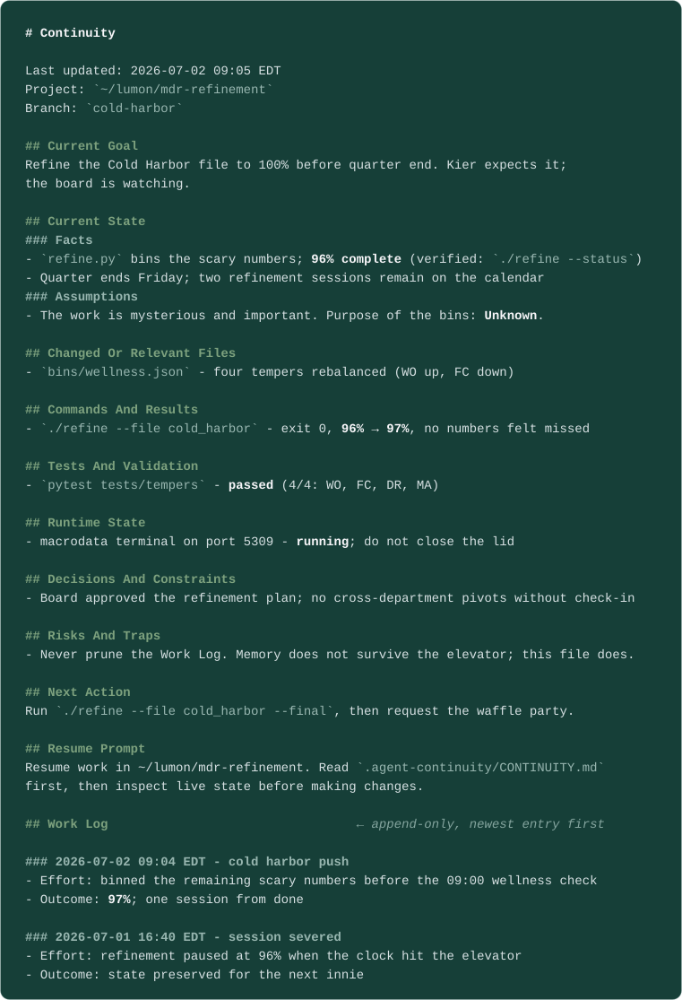

<div align="center">

<picture>
  <source media="(prefers-color-scheme: dark)" srcset="assets/continuity-mark-dark.svg">
  
</picture>

# continuity

**Manual project memory for coding agents.**

Ask your agent to "log work" — get a durable, human-readable resume note that lives with your project.

[](https://agentskills.io/specification) [](https://platform.claude.com/docs/en/agents-and-tools/agent-skills/best-practices) [](https://developers.openai.com/codex/skills) [](LICENSE)

</div>

---

`continuity` is a small [Agent Skill](https://agentskills.io/specification) that writes a project-local memory note at `.agent-continuity/CONTINUITY.md` — on demand, never in the background. It is intentionally boring: one `SKILL.md`, one Markdown output file, no service, no database, no background capture.

Built to the [Agent Skills specification](https://agentskills.io/specification) and [Anthropic's skill-authoring best practices](https://platform.claude.com/docs/en/agents-and-tools/agent-skills/best-practices), with an [eval suite](evals/) to match — see [Grounded In Official Guidance](docs/OVERVIEW.md#grounded-in-official-guidance).

## What It Leaves Behind



The record is cumulative: each run refreshes the head and prepends a dated work-log entry — history is never deleted. See a [full example record](examples/CONTINUITY.example.md).

## Quick Start

Point your agent at the repo:

```text
Install the continuity Agent Skill from
https://github.com/mychaelconnolly/continuity-skill — copy skills/continuity
into your skills directory and reload skills.
```

Or manually — same move everywhere, only the destination differs:

```sh
git clone https://github.com/mychaelconnolly/continuity-skill
cp -R continuity-skill/skills/continuity <your-skills-dir>
# e.g. ~/.claude/skills, ~/.codex/skills, ~/.agents/skills, .gemini/skills
```

If your tool does not discover Agent Skills at all, paste [`adapters/generic-prompt.md`](adapters/generic-prompt.md) into its custom instructions instead. Per-tool notes live in [docs/OVERVIEW.md](docs/OVERVIEW.md#install).

Then, at any natural stopping point:

```text
log work
```

And in any future session:

```text
pull up <project>
```

`resume work on <project>` and `where were we` work too — the skill recognizes resume intent, reads the record, verifies it against live state, and continues. In a tool without the skill, paste the note's own portable [Resume Prompt](examples/CONTINUITY.example.md#resume-prompt) instead — every record carries one.

## More

- **[Overview & details](docs/OVERVIEW.md)** — why manual memory, what gets recorded, ecosystem fit, safety model, and the standards this is built to.
- **[Model routing (optional)](docs/OVERVIEW.md#model-routing-optional)** — run ordinary logging on a cheaper one-tier-down model via the bundled `continuity-writer` profiles.
- **[Full example record](examples/CONTINUITY.example.md)** — a complete `.agent-continuity/CONTINUITY.md`.
