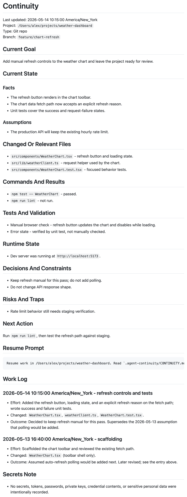

# continuity — Overview

Detailed documentation for the `continuity` Agent Skill. For the short version, see the [README](../README.md).

<p align="center">
  <a href="../examples/CONTINUITY.example.md">
    
  </a>
</p>

<p align="center"><sub>What you get: an example <a href="../examples/CONTINUITY.example.md"><code>.agent-continuity/CONTINUITY.md</code></a> — current goal, verified facts, an append-only work log, and a resume prompt.</sub></p>

## What You Get

When invoked, the skill tells the agent to inspect current state and create or update `.agent-continuity/CONTINUITY.md`, capturing:

- current goal
- verified state and assumptions
- relevant files
- commands already run and results
- tests and validation
- runtime state when relevant
- decisions, constraints, risks, and next action
- a resume prompt for the next session or next tool
- an append-only work log of past sessions

The record is cumulative. Each run refreshes the current-state head and prepends a new dated work-log entry; it never deletes earlier entries. History is preserved across updates, so you accumulate a record of efforts as they are made, while the top of the file stays a clean resume point.

Then, in any future session:

```text
pull up <project>
```

Short resume phrasings — "resume work on <project>", "where were we", "pick up where we left off" — are recognized as resume intent: the skill reads the record head, verifies it against live state, reports the goal and next action, and continues without rewriting the record. In a tool without the skill installed, paste the note's own Resume Prompt section instead — every record carries a portable one:

```text
Resume work in <project path>. Read `.agent-continuity/CONTINUITY.md` first, then inspect live state before making changes.
```

More prompts that trigger the skill:

```text
Use $continuity to log work before I clear this session.
```

```text
Save continuity for this project. Include the current goal, changed files, tests run, risks, and next action.
```

```text
Prepare for session clearing. Write the project continuity note first.
```

## Install

The generic path in the [README Quick Start](../README.md#quick-start) works everywhere: copy `skills/continuity` into your tool's skills directory. Per-tool notes:

### Codex

Install from the skill folder:

```text
https://github.com/mychaelconnolly/continuity-skill/tree/main/skills/continuity
```

Or copy `skills/continuity` into your Codex skills directory, then start a new session or reload skills according to your Codex setup.

### Claude Code

```sh
# personal skill
mkdir -p ~/.claude/skills
cp -R skills/continuity ~/.claude/skills/continuity

# or project skill
mkdir -p .claude/skills
cp -R skills/continuity .claude/skills/continuity
```

Invoke it directly with `/continuity`, or ask Claude to log continuity when the description matches your request.

### Gemini CLI

```sh
gemini skills link ./skills/continuity
```

Or copy it into a project:

```sh
mkdir -p .gemini/skills
cp -R skills/continuity .gemini/skills/continuity
```

Gemini CLI also documents `.agents/skills` as a discovery alias, so the same folder can be shared with other Agent Skills clients.

### Everything Else

If your tool does not discover Agent Skills, paste [`adapters/generic-prompt.md`](../adapters/generic-prompt.md) into the agent's project instructions or custom prompt area. The behavior is the same: create or update `.agent-continuity/CONTINUITY.md` when explicitly asked.

## Why Manual?

I made this in May 2026, while agent memory is still moving quickly across Codex, Claude, Gemini, Grok-backed tools, MCP memory servers, and stateful-agent frameworks. I expect agentic memory to become more native, consent-aware, auditable, project-scoped, and portable soon.

While that settles, I still want a manual switch:

- "log work"
- "save continuity"
- "prepare for session clearing"
- "write down what the next agent needs"

The result is both agent memory and project documentation. The agent gets the verified state it needs to resume. I get a Markdown record I can inspect, edit, commit or ignore, and carry with the project. Use this when you prefer an intentional memory action instead of background capture.

## Model Routing (Optional)

The skill works the same on whatever model you run it with. If you want ordinary logging to run cheaper, install a bundled `continuity-writer` profile so plain "log work" requests can be delegated to a strong one-tier-down model at low effort, while risky work (audits, secret redaction, multi-root, runtime-heavy handoffs) stays on the stronger/current model.

Routing is best-effort, not enforced: a runtime may still log inline on the current model even with the profile installed. To force the cheaper path, name the profile explicitly — for example, "use the continuity-writer profile to log work."

```sh
# Claude Code
cp skills/continuity/profiles/continuity-writer.claude.md ~/.claude/agents/continuity-writer.md

# Codex
cp skills/continuity/profiles/continuity-writer.codex.toml ~/.codex/agents/continuity-writer.toml
```

This is optional: with no profile installed, the skill runs inline on the current model with no loss of function. Routing changes only which model writes the record, never the format or the safety rules. See [`skills/continuity/profiles/README.md`](../skills/continuity/profiles/README.md) for profile names, install paths, model-routing behavior, fallback, and the sync workflow.

## Where It Fits

This skill is not a replacement for larger memory systems. It fills a narrower gap.

| Category | Examples | What they are good at | Where continuity fits |
| --- | --- | --- | --- |
| Native agent memory | Codex Memories, Gemini Auto Memory | Automatic recall and experience-level personalization | Explicit project-local notes you can inspect |
| MCP or cloud memory | Mem0, OpenMemory, Supermemory | Cross-app memory, semantic recall, hosted or configured stores | No service dependency, plain Markdown |
| Stateful-agent frameworks | Letta, LangGraph/LangMem, Zep/Graphiti | Building applications with persistent agent state | Lightweight workflow for local coding projects |
| Project docs | README, status docs, issue comments | Human-facing durable context | Standard resume shape for agents and humans |

## Safety Model

The skill instructs the agent not to record secrets, tokens, passwords, private keys, raw credential values, or sensitive personal data. It also tells the agent to mark unknowns explicitly instead of guessing.

Because the output is Markdown, you can review it before sharing, committing, or using it with another tool.

## Grounded In Official Guidance

`continuity` follows the published standards for how agent skills should be built — so it triggers reliably, installs cleanly across tools, and ages well as agent memory matures. It is built to the guidance, not just inspired by it:

- **[Agent Skills specification](https://agentskills.io/specification)** (agentskills.io) — the cross-vendor standard the skill conforms to: a `SKILL.md` folder with YAML frontmatter and progressive disclosure.
- **[Anthropic — Skill authoring best practices](https://platform.claude.com/docs/en/agents-and-tools/agent-skills/best-practices)** — third-person trigger descriptions, a sub-500-line `SKILL.md`, and eval-first design. The repo ships an [`evals/`](../evals/) suite to match.
- **[OpenAI — Codex Skills](https://developers.openai.com/codex/skills)** — the Codex install path, plus the bundled [`agents/openai.yaml`](../skills/continuity/agents/openai.yaml) interface for Codex.

## Project Layout

```text
continuity-skill/
├── README.md
├── LICENSE
├── adapters/
│   └── generic-prompt.md
├── assets/
│   ├── continuity-example.png
│   ├── continuity-mark-dark.svg
│   └── continuity-mark-light.svg
├── docs/
│   └── OVERVIEW.md
├── evals/
│   ├── README.md
│   └── scenarios.md
├── examples/
│   └── CONTINUITY.example.md
└── skills/
    └── continuity/
        ├── SKILL.md
        ├── agents/
        │   └── openai.yaml
        └── profiles/
            ├── README.md
            ├── continuity-writer.claude.md
            └── continuity-writer.codex.toml
```

## References

**Authoritative sources** — the standards and guidance `continuity` is built to:

- [Agent Skills specification](https://agentskills.io/specification) — agentskills.io
- [Anthropic — Skill authoring best practices](https://platform.claude.com/docs/en/agents-and-tools/agent-skills/best-practices)
- [OpenAI — Codex Skills](https://developers.openai.com/codex/skills)
- [Claude Code skills](https://code.claude.com/docs/en/skills)

**Ecosystem** — related agent-memory tooling and docs:

- [OpenAI Codex Memories](https://developers.openai.com/codex/memories)
- [OpenAI Codex feature maturity](https://developers.openai.com/codex/feature-maturity)
- [OpenAI skills catalog](https://github.com/openai/skills)
- [Gemini CLI Agent Skills](https://geminicli.com/docs/cli/tutorials/skills-getting-started/)
- [Gemini CLI Auto Memory](https://geminicli.com/docs/cli/auto-memory/)
- [xAI Grok Code Fast](https://docs.x.ai/developers/models/grok-code-fast-1)
- [Mem0 MCP](https://docs.mem0.ai/platform/mem0-mcp)
- [OpenMemory](https://mem0.ai/openmemory)
- [Supermemory MCP](https://supermemory.ai/docs/supermemory-mcp/introduction)
- [Letta stateful agents](https://docs.letta.com/guides/core-concepts/stateful-agents)
- [LangChain memory](https://docs.langchain.com/oss/python/concepts/memory)
- [Zep Graphiti](https://help.getzep.com/graphiti/getting-started/overview)
